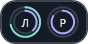
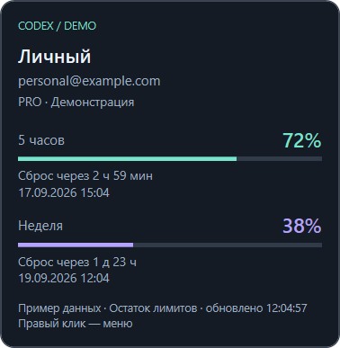

# Codex Limits for Windows 11

Компактный виджет для двух аккаунтов ChatGPT / Codex: только две круглые иконки
с инициалами аккаунтов. Внешнее бирюзовое кольцо показывает **оставшийся** лимит
за 5 часов, внутреннее фиолетовое — за неделю. При наведении открывается карточка
только соответствующего аккаунта: имя, email, тариф/статус, проценты, время
до сброса и дата сброса, время последнего обновления.
Панель можно закрепить у любого края монитора с размером и смещением в физических
пикселях. Не вызывает модель и не создаёт задач Codex.





## Download

[](https://github.com/SergeySTB/codexutils/releases/download/v1.1/CodexLimits-Setup_v1.1.exe)

Инсталлятор запрашивает права администратора, устанавливает приложение в
`C:\Program Files\Codex Limits`, создаёт ярлык в меню «Пуск» и запись в списке
установленных приложений Windows. Удаление через этот список убирает программу
и ярлык, но сохраняет ваш `config.json` в профиле пользователя.

Кнопка скачивает установщик из последнего стабильного релиза.
Все версии и описание изменений доступны на [странице релизов](https://github.com/SergeySTB/codexutils/releases).

## Запуск

Требуются Windows 11, .NET Desktop Runtime 8 (x64 для приложенной x64-сборки) и
установленный Codex CLI с командой `app-server`. На машине разработки уже есть
подходящий .NET. Проверена совместимость с Codex CLI 0.147.0.

1. Запустите скачанный файл установщика.
2. Нажмите первую иконку (**Л**) и завершите вход в браузере через первый аккаунт ChatGPT.
3. Затем нажмите вторую иконку (**Р**) и войдите через второй аккаунт. В браузере выберите
   другой аккаунт, если он предлагает ранее использованный. Одновременно запускается
   только одна процедура входа; лимиты обоих аккаунтов обновляются независимо.
4. Наведите указатель на иконку для подробностей. Карточка раскрывается внутрь
   экрана и скрывается, когда указатель покидает иконку. Её также можно открыть
   клавиатурным фокусом и закрыть Escape. Правый клик по панели или
   значку в трее открывает настройки, обновление и выход.

Нажатие подключённого аккаунта показывает карточку, не запускает повторный вход.
Для повторной авторизации используйте **Войти: ...** в контекстном меню.

Если у обоих профилей одинаковый email, карточка показывает предупреждение:
проверьте выбранные аккаунты. При первом запуске, пока вход не выполнен, `—`
означает отсутствие данных, а не отсутствие расхода.

Приложение находит `codex.exe` в PATH или в
`%LOCALAPPDATA%\Programs\OpenAI\Codex\bin`. Если оно не найдено, откройте
конфигурацию через меню, укажите `codexExecutable` и примените настройки.
Для установки Codex CLI через npm, где в PATH находится только `codex.cmd`,
нужно указать путь к настоящему исполняемому файлу `codex.exe` внутри пакета.

## Конфигурация

При первом обычном запуске создаётся
`%LOCALAPPDATA%\CodexLimits\config.json`. Меню **Открыть конфигурацию** открывает
его в Блокноте; **Применить конфигурацию** перечитывает файл без перезапуска.
При ошибке JSON или некорректных параметрах предыдущие настройки сохраняются.
Редактировать файл во время процедуры входа можно, применять — после её завершения.

Пример всех параметров находится в `config/config.example.json` в репозитории
и в `config.example.json` рядом с установленным приложением.
При установке `%LOCALAPPDATA%\CodexLimits\config.json` обновляется по текущему
шаблону: существующие значения сохраняются, новые параметры получают значения
по умолчанию, удалённые параметры исключаются (в том числе внутри аккаунтов и
`widget`). Аккаунты сопоставляются по порядку. Исходный файл сохраняется рядом
как `config.json.<идентификатор>.bak`. При повреждённом JSON установка
останавливается, исходный файл остаётся нетронутым. Файлы, указанные через
`--config`, установщик не изменяет.

Имена свойств чувствительны к регистру, неизвестные свойства и комментарии
не допускаются. `accounts` должен содержать ровно два элемента.

| Параметр | Значение |
|---|---|
| `codexExecutable` | Абсолютный путь к `codex.exe`; пустая строка — поиск автоматически |
| `accounts[].name` | Подпись аккаунта, до 60 символов |
| `accounts[].codexHome` | Абсолютный путь к отдельному профилю; поддерживаются `%LOCALAPPDATA%` и `%USERPROFILE%` |
| `widget.widthPx`, `heightPx` | Размер панели иконок в физических пикселях, по умолчанию 88×44, от 64×32 до 4096×2160; размер карточки не зависит от этого масштаба |
| `widget.edge` | `top`, `bottom`, `left`, `right` |
| `widget.offsetPx` | Для top/bottom — от левого края вправо; для left/right — от верхнего края вниз |
| `widget.marginPx` | Отступ от выбранного края, от -4096 до 4096; положительный — внутрь, отрицательный — наружу (для bottom: вниз, поверх панели задач) |
| `widget.monitor` | `primary` либо имя Windows, например `\\.\DISPLAY2` (в JSON: `"\\\\.\\DISPLAY2"`) |
| `widget.alwaysOnTop` | Поверх обычных окон; не гарантируется поверх эксклюзивного полноэкранного режима |
| `widget.respectTaskbar` | `true` — отсчёт от рабочей области без панели задач; `false` — от физических границ экрана |
| `refreshSeconds` | Интервал обновления, от 30 до 3600 секунд, по умолчанию 60 |
| `notifyOnLimitReset` | `true` — подать системный звук, когда при успешном обновлении лимит меняется с менее 100% на 100%; по умолчанию `false` |

Положение ограничивается границами выбранного экрана. Если монитор отключён,
приложение временно использует основной. При смене DPI и конфигурации экранов
позиция пересчитывается. На всех четырёх краях сохраняются две иконки рядом.
Карточка открывается под верхним краем, над нижним, справа от левого и слева
от правого. Стандартный старый размер 360×144 при загрузке трактуется как 88×44;
сам файл и пути аккаунтов не перезаписываются. Другие заданные размеры сохраняются.

Произвольный конфигурационный файл:

```powershell
.\CodexLimits.exe --config "D:\Settings\codex-limits.json"
```

Просмотр интерфейса с явно обозначенными демонстрационными данными, без Codex,
входа и сетевых запросов:

```powershell
.\CodexLimits.exe --demo
```

## Структура репозитория

| Каталог | Назначение |
|---|---|
| `src/CodexLimits` | Исходный код приложения |
| `tests/CodexLimits.Checks` | Исполняемые проверки логики, интеграции и интерфейса |
| `packaging/windows` | Сценарии установки и обновления конфигурации |
| `config` | Эталонная конфигурация |
| `docs` | Изображения и материалы README |
| `.github/workflows` | Сборка, проверка и публикация установщика |

`CodexLimits.sln` объединяет приложение и проверки для IDE и командной строки.

## Авторизация и данные

Для каждого профиля запускается собственный скрытый `codex app-server --stdio`.
`CODEX_HOME` задаётся только этому дочернему процессу; пользовательские переменные
окружения и основной профиль Codex не переключаются. По умолчанию используются
две новые папки внутри `%LOCALAPPDATA%\CodexLimits\profiles`.

Вход выполняется стандартным OAuth-механизмом Codex. Сам Codex сохраняет и обновляет
авторизацию в `auth.json` своего профиля (`cli_auth_credentials_store="file"`).
Виджет не читает и не копирует токены, не записывает ответы сервиса и адреса входа
в журналы. **Папки профилей и auth.json нельзя публиковать или пересылать.**
Если указать уже существующий профиль, Codex может обновить его авторизацию;
рекомендуются отдельные папки по умолчанию. API-ключ не заменяет вход через ChatGPT.

Запросы: `initialize`, `initialized`, `account/read`, `account/rateLimits/read`;
вход по нажатию пользователя: `account/login/start` / `account/login/cancel`.
Нет автоматического выхода из аккаунта, расходования reset-кредитов, обращения
к API генерации или запуска задач. При выходе закрываются только дочерние процессы
данного виджета. Другие экземпляры Codex не завершаются.

Окна определяются по `windowDurationMins`: 300 и 10080. Используется основной
bucket `codex`; отдельные квоты Spark не подставляются вместо него.
OpenAI может отдавать только недельное окно или не отдавать окна вовсе: виджет
показывает `—`. Процент округляется вниз, чтобы остаток меньше 100% не выглядел
полностью восстановленным.

При ошибках сохраняется последнее удачное чтение **в памяти** с пометкой
«Данные устарели» в карточке и приглушёнными иконками. Повторы замедляются до 15 минут;
после ответа 429 ручное обновление тоже ждёт назначенного срока. После перезапуска
последние проценты и срок ожидания не восстанавливаются. Просроченное время сброса
само по себе не устанавливает остаток в 100%: нужен свежий ответ сервиса.

## Сборка и проверки

Нужен .NET SDK 8 для Windows. Сторонних NuGet-пакетов нет; `NuGet.Config` отключает
внешние источники. Сборка использует установленные reference packs и работает офлайн.

```powershell
powershell -NoProfile -ExecutionPolicy Bypass -File .\build.ps1
```

Результат: `dist\CodexLimits-Setup_v<major>.<minor>.exe`. Временные файлы сборки находятся в
`.build\publish`.
Это framework-dependent сборка: .NET Desktop Runtime должен быть установлен.
Файлы DLL и runtimeconfig рядом с EXE нужны для запуска. Скрипт не коммитит и
не публикует изменения, не устанавливает автозапуск и не меняет пользовательский
профиль Codex.

Установщик хранится в GitHub Releases, а не в Git. Для публикации после
согласования версии и отправки коммита создайте стабильный релиз с тегом
`v<major>.<minor>` на этом коммите. Workflow **Windows Package** проверит
совпадение тега с версией проекта, соберёт установщик и прикрепит к релизу
`CodexLimits-Setup_v<major>.<minor>.exe`. Вместе с повышением версии обновите
прямую ссылку кнопки загрузки на этот asset. Для pull request и изменений в `main` тот же
workflow сохраняет проверенный установщик как временный GitHub Actions artifact.

`tests/CodexLimits.Checks` — исполняемые проверки без тестовых библиотек: разбор квот, валидация
настроек, четыре края, ограничения экрана, два независимых дочерних процесса,
инициализация протокола, OAuth-уведомление, тайм-аут, 429, выход сервера и очистка.
Тестовые профили создаются только в `.build\checks`.

```powershell
dotnet run --project tests/CodexLimits.Checks/CodexLimits.Checks.csproj -c Release
# Дополнительно: реальный установленный CLI, изолированный пустой профиль, без входа.
.\tests\CodexLimits.Checks\bin\Release\net8.0-windows\CodexLimits.Checks.exe --real-codex "C:\path\to\codex.exe"
# Реальное наведение на обе иконки у четырёх краёв, проверка карточек, снимки PNG.
# Только демонстрационные данные, положение курсора восстанавливается после теста.
.\tests\CodexLimits.Checks\bin\Release\net8.0-windows\CodexLimits.Checks.exe --widget "$PWD\.build\icon-preview"
# WPF-окно с демоданными: сохранить PNG и закрыться.
.\.build\publish\CodexLimits.exe --smoke-test "$PWD\.build\preview.png"
```

Вход в два настоящих аккаунта проверяется пользователем: тесты не открывают
его авторизацию. На нескольких физических мониторах с разным DPI требуется
ручная проверка; автоматические проверки покрывают расчёт координат.
