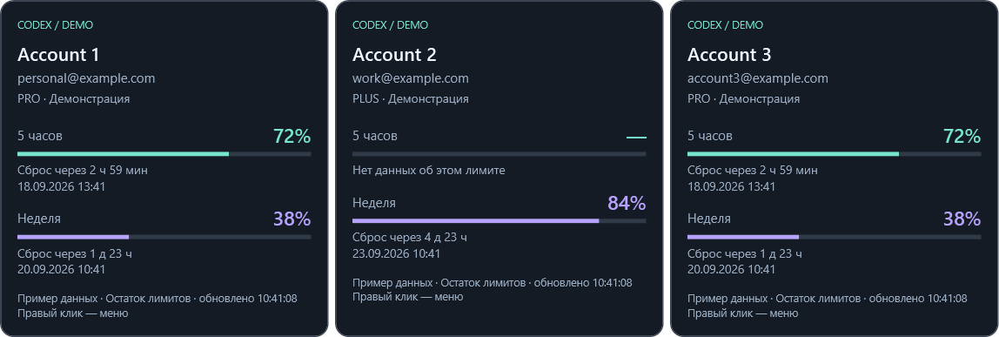

# AI Usage Monitor

Версия для Windows 11 — компактный виджет для аккаунтов ChatGPT / Codex: по одной круглой иконке
с инициалом на каждую запись в конфигурации. Внешнее бирюзовое кольцо показывает
**оставшийся** лимит
за 5 часов, внутреннее фиолетовое — за неделю. При наведении открывается карточка
только соответствующего аккаунта: имя, email, тариф/статус, проценты, время
до сброса и дата сброса, время последнего обновления.
Панель можно закрепить у любого края монитора с размером и смещением в физических
пикселях. Не вызывает модель и не создаёт задач Codex.

Режим `cards` показывает подробности всех аккаунтов постоянно, без иконок:
у верхнего и нижнего края — в строку, у левого и правого — в столбец.
Размер каждой карточки можно задать отдельно от размера компактной панели.




## Download

[](https://github.com/SergeySTB/codexutils/releases/download/v3.2/AIUsageMonitor-Setup_v3.2.exe)

Инсталлятор запрашивает права администратора, устанавливает приложение в
`C:\Program Files\AI Usage Monitor`, создаёт ярлык в меню «Пуск» и запись в списке
установленных приложений Windows. Удаление через этот список убирает программу
и ярлык, но сохраняет ваш `config.json` в профиле пользователя.

При обновлении инсталлятор закрывает работающий AI Usage Monitor перед заменой
файлов. В конце он показывает результат установки. При успехе флажок
**Запустить AI Usage Monitor после установки** включён по умолчанию; его можно снять.
При ошибке флажок недоступен.
Установка и миграция конфигурации выполняются без консольных окон; Windows
показывает только запрос прав администратора и итоговое окно установки.
Оконный запускатель не создаёт CMD или консоль PowerShell и оставляет итоговое
окно видимым до нажатия **Закрыть**.
При обновлении с прежнего имени установщик переносит программу из
`C:\Program Files\Codex Limits` в новую папку, сохраняя конфигурацию.

Кнопка ведёт к установщику текущего стабильного релиза.
Все версии и описание изменений доступны на [странице релизов](https://github.com/SergeySTB/codexutils/releases).

## Android

[](https://github.com/SergeySTB/codexutils/releases/download/v4.4/AIUsageMonitor-Android_v4.4-debug.apk)

В каталоге `android` находится самостоятельное Android-приложение (Android 8 и новее).
Телефон выполняет вход через ChatGPT по коду устройства и сам получает лимиты Codex;
работающий компьютер ему не нужен. Можно добавить несколько аккаунтов. Для каждого
показаны оставшиеся проценты и время сброса 5-часового и недельного окон. Если окно
не пришло от сервиса, показано `—`. Обновление происходит раз в минуту, пока
приложение открыто. В исходной версии Android 5.0 добавлены два виджета главного
экрана: **значки** (по одному на аккаунт в строке, внешняя дуга — 5 часов,
внутренняя — неделя) и **карточки** (прокручиваемый список аккаунтов с процентами
и временем сброса, без значков).
Добавьте нужный вариант через меню виджетов Android; нажатие открывает приложение.
Виджеты используют последний сохранённый результат и запрашивают новые лимиты
примерно каждые 30 минут, пока они размещены. Android может задерживать фоновые
обновления для экономии батареи; открытое приложение обновляет виджеты сразу.
Показывается основной лимит Codex; отдельные квоты моделей не подставляются вместо него.

При входе нужно разрешить [вход по коду устройства](https://developers.openai.com/codex/auth)
в настройках безопасности ChatGPT, если он отключён. Данные входа хранятся только
в зашифрованном хранилище приложения Android; профили Windows не копируются.
Кнопка **Убрать аккаунт** удаляет данные входа с телефона.
Если вход не завершился, приложение показывает этап и тип ошибки без вывода кодов и токенов.

Мобильная версия использует адреса сервиса из открытого исходного кода Codex.
Они не объявлены стабильным публичным API для сторонних приложений, поэтому
вход и получение лимитов требуют проверки на настоящем телефоне перед релизом.
Кнопка пока загружает опубликованный APK `v4.4`, без новых виджетов. APK подписан отладочным ключом;
его можно установить поверх предыдущих отладочных сборок без удаления аккаунтов.

Для локальной сборки откройте каталог `android` в Android Studio и соберите
`app` как debug APK либо задайте `ANDROID_HOME` и запустите
`powershell -NoProfile -ExecutionPolicy Bypass -File android/build.ps1`.
Нужны Android SDK Platform 35, Build Tools 35 и JDK 17 или новее. Скрипт создаёт
отладочный APK из текущих исходников в `dist/AIUsageMonitor-Android_v5.0-debug.apk`;
это не релизная подпись. Исходная версия 5.0 ещё не опубликована как GitHub Release.

## Запуск

Требуются Windows 11, .NET Desktop Runtime 8 (x64 для приложенной x64-сборки) и
установленный Codex CLI с командой `app-server`. На машине разработки уже есть
подходящий .NET. Проверена совместимость с Codex CLI 0.147.0.

1. Запустите скачанный файл установщика и подтвердите права администратора.
2. В итоговом окне оставьте включённым флажок запуска, если хотите открыть виджет
   сразу, затем нажмите **Закрыть**.
3. По умолчанию в конфигурации один аккаунт. Нажмите его иконку (**Л**) и
   завершите вход в браузере через ChatGPT.
4. Чтобы добавить аккаунт, откройте конфигурацию, добавьте в `accounts` ещё один
   объект по английскому примеру в комментарии и задайте ему отдельный `codexHome`.
   Примените конфигурацию и войдите через появившуюся иконку. Одновременно запускается
   только одна процедура входа; лимиты аккаунтов обновляются независимо.
5. Наведите указатель на иконку для подробностей. Карточка раскрывается внутрь
   экрана и скрывается, когда указатель покидает иконку. Её также можно открыть
   клавиатурным фокусом и закрыть Escape. Правый клик по панели или
   значку в трее открывает настройки, обновление и выход.

Нажатие подключённого аккаунта показывает карточку, не запускает повторный вход.
Для повторной авторизации используйте **Войти: ...** в контекстном меню.
В режиме `cards` для первого входа есть кнопка **Войти через ChatGPT** в каждой
неподключённой карточке; контекстное меню доступно правым кликом по карточкам.

Если несколько профилей используют одинаковый email, их карточки показывают
предупреждение:
проверьте выбранные аккаунты. При первом запуске, пока вход не выполнен, `—`
означает отсутствие данных, а не отсутствие расхода.

Во время установки выполняется поиск настоящего `codex.exe` в PATH, в папках
Codex Desktop и внутри глобального npm-пакета. Найденный абсолютный путь
записывается в `codexExecutable`. Если путь уже задан пользователем, установщик
его не заменяет. Если Codex установлен позже и поиск приложения его не находит,
откройте конфигурацию через меню, укажите `codexExecutable` и примените настройки.

## Конфигурация

При установке создаётся `%LOCALAPPDATA%\AIUsageMonitor\config.json`. Если приложение
запущено напрямую без установки, файл создаётся при первом обычном запуске. Меню
**Открыть конфигурацию** открывает его в Блокноте; **Применить конфигурацию**
перечитывает файл без перезапуска.
Если новый файл ещё не создан, но найден `%LOCALAPPDATA%\CodexLimits\config.json`,
приложение и установщик продолжают использовать прежний файл. Существующие пути
`codexHome` сохраняются, поэтому повторный вход в аккаунты не требуется.
При ошибке JSON или некорректных параметрах предыдущие настройки сохраняются.
Редактировать файл во время процедуры входа можно, применять — после её завершения.

Пример всех параметров находится в `config/config.example.json` в репозитории
и в `config.example.json` рядом с установленным приложением.
При установке выбранный конфигурационный файл обновляется по текущему
шаблону: существующие значения сохраняются, пустой `codexExecutable` заполняется
найденным путём, новые параметры получают значения
по умолчанию, удалённые параметры исключаются (в том числе внутри аккаунтов и
`widget`). Количество аккаунтов, их порядок и существующие значения сохраняются.
Исходный файл сохраняется рядом
как `config.json.<идентификатор>.bak`. При повреждённом JSON установка
останавливается, исходный файл остаётся нетронутым. Файлы, указанные через
`--config`, установщик не изменяет.

Имена свойств чувствительны к регистру, неизвестные свойства не допускаются.
Допускаются комментарии `//` и `/* ... */`; поставляемый английский комментарий
показывает пример второго аккаунта. `accounts` должен содержать хотя бы один
элемент, а каждый `codexHome` должен быть уникальным.

| Параметр | Значение |
|---|---|
| `codexExecutable` | Абсолютный путь к `codex.exe`; пустая строка — поиск автоматически |
| `accounts[].name` | Подпись аккаунта, до 60 символов |
| `accounts[].codexHome` | Абсолютный путь к отдельному профилю; поддерживаются `%LOCALAPPDATA%` и `%USERPROFILE%` |
| `widget.displayMode` | `icons` — компактная панель с подсказками (по умолчанию); `cards` — постоянно открытые карточки всех аккаунтов |
| `widget.iconWidthPx`, `widget.iconHeightPx` | Размер всей компактной панели иконок в физических пикселях: по умолчанию 88×44, от 64×32 до 4096×2160; игнорируется в режиме `cards` |
| `widget.cardWidthPx`, `widget.cardHeightPx` | Размер каждой постоянно открытой карточки в физических пикселях: 64×32–4096×2160; `0` — автоматический размер по соответствующей оси (по умолчанию оба `0`); игнорируется в режиме `icons` |
| `widget.edge` | `top`, `bottom`, `left`, `right` |
| `widget.offsetPx` | Для top/bottom — от левого края вправо; для left/right — от верхнего края вниз |
| `widget.marginPx` | Отступ от выбранного края, от -4096 до 100000; положительный — внутрь, отрицательный — наружу (для bottom: вниз, поверх панели задач) |
| `widget.monitor` | `primary` либо имя Windows, например `\\.\DISPLAY2` (в JSON: `"\\\\.\\DISPLAY2"`) |
| `widget.alwaysOnTop` | Поверх обычных окон; не гарантируется поверх эксклюзивного полноэкранного режима |
| `widget.respectTaskbar` | `true` — отсчёт от рабочей области без панели задач; `false` — от физических границ экрана |
| `refreshSeconds` | Интервал обновления, от 30 до 3600 секунд, по умолчанию 60 |
| `notifyOnLimitReset` | `true` — подать системный звук, когда при успешном обновлении лимит меняется с менее 100% на 100%; по умолчанию `false` |

Положение ограничивается границами выбранного экрана. Если монитор отключён,
приложение временно использует основной. При смене DPI и конфигурации экранов
позиция пересчитывается. На всех четырёх краях настроенные иконки располагаются рядом.
В режиме `icons` подсказка открывается под верхним краем, над нижним, справа от
левого и слева от правого. В режиме `cards` аккаунты идут в порядке массива
`accounts`: в строку для `top`/`bottom`, в столбец для `left`/`right`.
Автоматическая ширина карточки — 302 логических пикселя с учётом масштаба Windows,
автоматическая высота зависит от содержимого. Если заданной высоты не хватает,
содержимое карточки прокручивается; если вся панель не помещается на экране,
появляется прокрутка панели.

Чтобы показать карточки, установите `widget.displayMode` в `"cards"` и нажмите
**Применить конфигурацию**. Например, `cardWidthPx: 380` и `cardHeightPx: 400`
задают каждой карточке размер 380×400 физических пикселей. Для автоматической
высоты оставьте `cardHeightPx: 0`. Для возврата к иконкам выберите `"icons"`.
Этот режим также можно переключить из контекстного меню виджета или его значка в трее.

Панель иконок и карточки можно перетаскивать левой кнопкой мыши. У карточек тяните
за фон или текст, кроме кнопки входа и полосы прокрутки. После отпускания кнопки
монитор и позиция сохраняются в `monitor`, `offsetPx` и `marginPx` и восстанавливаются
при следующем запуске. Перетаскивание устанавливает `respectTaskbar: false`, чтобы
можно было расположить окно и поверх панели задач. Значение `edge` и ориентация
карточек сохраняются. В режиме `--demo` перетаскивание не записывает конфигурацию.

Старые `widthPx`/`heightPx` читаются как `iconWidthPx`/`iconHeightPx` и переименовываются
при установке с сохранением значений. Если указаны оба варианта, новые имена имеют
приоритет. Старое сочетание 360×144 переносится как 88×44; размеры, явно заданные
новыми именами, сохраняются точно. Загрузка приложением не перезаписывает файл.

Произвольный конфигурационный файл:

```powershell
.\AIUsageMonitor.exe --config "D:\Settings\ai-usage-monitor.json"
```

Просмотр интерфейса с явно обозначенными демонстрационными данными, без Codex,
входа и сетевых запросов:

```powershell
.\AIUsageMonitor.exe --demo
```

## Структура репозитория

| Каталог | Назначение |
|---|---|
| `src/AIUsageMonitor` | Исходный код приложения |
| `tests/AIUsageMonitor.Checks` | Исполняемые проверки логики, интеграции и интерфейса |
| `packaging/windows` | Сценарии установки и обновления конфигурации |
| `config` | Эталонная конфигурация |
| `docs` | Изображения и материалы README |
| `.github/workflows` | Сборка, проверка и публикация установщика |

`AIUsageMonitor.sln` объединяет приложение и проверки для IDE и командной строки.

## Авторизация и данные

Для каждого профиля запускается собственный скрытый `codex app-server --stdio`.
`CODEX_HOME` задаётся только этому дочернему процессу; пользовательские переменные
окружения и основной профиль Codex не переключаются. По умолчанию используется
папка `%LOCALAPPDATA%\AIUsageMonitor\profiles\personal`; для каждого добавленного
аккаунта нужна отдельная папка.

Вход выполняется стандартным OAuth-механизмом Codex. Сам Codex сохраняет и обновляет
авторизацию в `auth.json` своего профиля (`cli_auth_credentials_store="file"`).
Виджет не читает и не копирует токены, не записывает ответы сервиса и адреса входа
в журналы. **Папки профилей и auth.json нельзя публиковать или пересылать.**
Если указать уже существующий профиль, Codex может обновить его авторизацию;
рекомендуются отдельные папки по умолчанию. API-ключ не заменяет вход через ChatGPT.

Запросы: `initialize`, `initialized`, `account/read`, `account/rateLimits/read`;
вход по нажатию пользователя: `account/login/start` / `account/login/cancel`.
Нет автоматического выхода из аккаунта, расходования reset-кредитов, обращения
к API генерации или запуска задач. При выходе закрываются только дочерние процессы
данного виджета. Другие экземпляры Codex не завершаются.

Окна определяются по `windowDurationMins`: 300 и 10080. Используется основной
bucket `codex`; отдельные квоты Spark не подставляются вместо него.
OpenAI может отдавать только недельное окно или не отдавать окна вовсе: виджет
показывает `—`. Процент округляется вниз, чтобы остаток меньше 100% не выглядел
полностью восстановленным.

При ошибках сохраняется последнее удачное чтение **в памяти** с пометкой
«Данные устарели» в карточке и приглушёнными иконками. Повторы замедляются до 15 минут;
после ответа 429 ручное обновление тоже ждёт назначенного срока. После перезапуска
последние проценты и срок ожидания не восстанавливаются. Просроченное время сброса
само по себе не устанавливает остаток в 100%: нужен свежий ответ сервиса.

## Сборка и проверки

Нужен .NET SDK 8 для Windows. Сторонних NuGet-пакетов нет; `NuGet.Config` отключает
внешние источники. Сборка использует установленные reference packs и работает офлайн.

```powershell
powershell -NoProfile -ExecutionPolicy Bypass -File .\build.ps1
```

Результат: `dist\AIUsageMonitor-Setup_v<major>.<minor>.exe`. Временные файлы сборки находятся в
`.build\publish`.
Это framework-dependent сборка: .NET Desktop Runtime должен быть установлен.
Файлы DLL и runtimeconfig рядом с EXE нужны для запуска. Скрипт не коммитит и
не публикует изменения, не устанавливает автозапуск и не меняет пользовательский
профиль Codex.

Установщик хранится в GitHub Releases, а не в Git. Для публикации после
согласования версии и отправки коммита создайте стабильный релиз с тегом
`v<major>.<minor>` на этом коммите. Workflow **Windows Package** проверит
совпадение тега с версией проекта, соберёт установщик и прикрепит к релизу
`AIUsageMonitor-Setup_v<major>.<minor>.exe`. Сборка проверяет, что прямая ссылка
кнопки загрузки в README указывает на asset с текущей версией. Для pull request
и изменений в `main` тот же workflow сохраняет проверенный установщик как
временный GitHub Actions artifact.

`tests/AIUsageMonitor.Checks` — исполняемые проверки без тестовых библиотек: разбор
квот, валидация настроек и произвольного количества аккаунтов, четыре края,
ограничения экрана, два независимых дочерних процесса,
инициализация протокола, OAuth-уведомление, тайм-аут, 429, выход сервера и очистка.
Тестовые профили создаются только в `.build\checks`.

```powershell
dotnet run --project tests/AIUsageMonitor.Checks/AIUsageMonitor.Checks.csproj -c Release
# Optional: installed CLI with an isolated empty profile, without signing in.
.\tests\AIUsageMonitor.Checks\bin\Release\net8.0-windows\AIUsageMonitor.Checks.exe --real-codex "C:\path\to\codex.exe"
# Hover over configured icons on all edges and verify tooltips; save PNGs.
# Uses demo data only and restores the cursor position afterwards.
.\tests\AIUsageMonitor.Checks\bin\Release\net8.0-windows\AIUsageMonitor.Checks.exe --widget "$PWD\.build\icon-preview"
# Check card layout, dimensions and mode switching without moving the cursor.
.\tests\AIUsageMonitor.Checks\bin\Release\net8.0-windows\AIUsageMonitor.Checks.exe --layout "$PWD\.build\cards-preview"
# Save a demo WPF window as PNG and exit.
.\.build\publish\AIUsageMonitor.exe --smoke-test "$PWD\.build\preview.png"
```

Вход в настоящие аккаунты проверяется пользователем: тесты не открывают
авторизацию. На нескольких физических мониторах с разным DPI требуется
ручная проверка; автоматические проверки покрывают расчёт координат.
