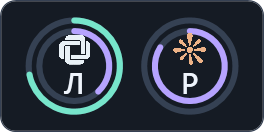
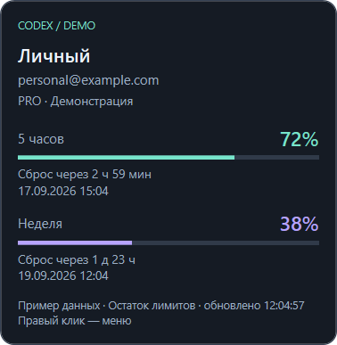
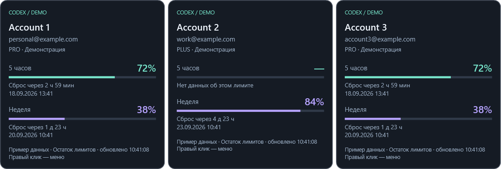

<p align="right"><strong>English</strong> | <a href="README.ru.md">Русский</a></p>

# AI Usage Monitor

A Windows 11 and Android app that shows the remaining Codex and Claude usage limits
for multiple accounts. The outer turquoise ring shows the remaining 5-hour limit;
the inner purple ring shows the remaining weekly limit. Each icon contains a
product symbol and the first letter of the account name.

The Windows installer and Windows/Android apps automatically use the system
language: Russian or English. Other system languages fall back to English.
In the Windows and Android app menus, you can choose **System language**, **Русский**
or **English**. Your choice is saved and applied without reinstalling; the Windows
installer always follows the system language.
Existing account names are preserved as user data.

On Windows, the compact panel shows one circular icon per account. Hover over an
icon to see a card with the plan, percentages, reset times and last update time.
You can position the panel along any monitor edge, with its size and offset set
in physical pixels.

The `cards` mode keeps all account details visible, without icons: a row along
the top or bottom edge, or a column along the left or right edge. Each card's
size can be set independently of the compact panel size.



In this enlarged example, the square interwoven symbol with `Л` represents a
personal Codex account, and the ray symbol with `Р` represents a work Claude account.
The turquoise ring shows the remaining 5-hour limit; the purple ring shows the
remaining weekly limit. The example uses demo data; actual percentages depend on
the account. These graphics were created for this app and are not official logos.
The app is not affiliated with or endorsed by OpenAI or Anthropic.
The origin of the graphics is described in [this note](docs/brand-icons.md).





## Windows

[](https://github.com/SergeySTB/codexutils/releases/download/v6.11/AIUsageMonitor-Setup_v6.11.exe)

The installer first lets you start or cancel installation. After you click
**Install**, it requests administrator privileges, installs the app in
`C:\Program Files\AI Usage Monitor` and adds a Start menu shortcut.
On the first screen, you can keep **Start when signing in to Windows** enabled
(for all users) or clear it. Clearing this option during an update disables
previously enabled startup; uninstalling also removes the startup entry.
You can launch the app from the completion screen.
Settings are preserved during updates and uninstallation. Other versions are
available on the [releases page](https://github.com/SergeySTB/codexutils/releases).

## Android

[](https://github.com/SergeySTB/codexutils/releases/download/v6.11/AIUsageMonitor-Android_v6.11-debug.apk)

The app runs on Android 8 and later without a computer once accounts are set up.
For Codex, sign in through ChatGPT using a device code. For Claude, run
`claude setup-token` on a computer, then choose **Add Claude** in the phone app menu
and enter an account name and the resulting OAuth token. The token is stored in
encrypted Android storage. The app does not renew it; when it expires, obtain a
new token and tap **Update sign-in** on the account card. You can add multiple
accounts. Each shows the remaining percentages and reset times for its 5-hour
and weekly limits. If the service does not return a limit, `—` appears instead
of a percentage. While the app is open, Codex refreshes every minute, and Claude
refreshes no more than once every five minutes.
If a Codex sign-in expires, the card shows **Sign in again**. This starts device
code sign-in for that account; signing in to another account does not replace it.

From the Android widget menu, you can add **icons** with usage limit rings or
**cards** with an account list to your home screen. The icon widget occupies two
cells by default. Ring diameter adapts to the available width and height: two
icons fit in two cells; expanding the widget allows three icons in three cells
or four in four cells. If space is insufficient, `+N` appears. The background
around the circles is translucent.
Tapping either widget opens the app.

The app menu offers **Add Codex**, **Add Claude**, **Refresh**, **Settings** and
**Remove account**. Before removing an account, the app asks you to select it
and confirm. Set the widget refresh interval under **Settings → Widget refresh
interval**: from 15 minutes to 24 hours, with a default of 30 minutes. Android may
delay background updates to save battery.
Individual model quotas are not used as a replacement for the main Codex or
Claude limit. Claude requests are spaced at least five minutes apart; after a
429 response, the app waits 15 minutes. The Claude usage endpoint is not a
published API for third-party apps and its behavior may change.

If disabled, enable [device code sign-in](https://developers.openai.com/codex/auth)
in ChatGPT security settings. Sign-in data is stored only in the Android app's
encrypted storage; Windows profiles are not copied.
Removing an account also removes its sign-in data from the phone.
If sign-in fails, the app shows the stage and error type without exposing codes
or tokens.

The Android APK is a preview build with a debug signature. Usage retrieval depends
on the Codex service, whose interface may change.

To build locally, open the `android` directory in Android Studio and build `app`
as a debug APK, or set `ANDROID_HOME` and run
`powershell -NoProfile -ExecutionPolicy Bypass -File android/build.ps1`.
You need Android SDK Platform 35, Build Tools 35 and JDK 17 or later. The script
creates `dist/AIUsageMonitor-Android_v<major>.<minor>-debug.apk`.

## Using the Windows app

Requires Windows 11 and .NET Desktop Runtime 8 (x64 for the provided x64 build).
Codex CLI is not required: the app signs in through ChatGPT and fetches limits
directly, as on Android. Claude requires signing in through Claude Code.

1. Run the downloaded installer and approve administrator privileges.
2. On the final screen, leave the launch option enabled if you want to open the
   widget immediately, then click **Close**.
3. The default configuration contains one Codex account. Click its icon
   (**square interwoven symbol / Л**) and complete ChatGPT sign-in in your browser.
4. In the panel or tray menu, choose **Add account**, then select the provider,
   name and a separate profile folder. Adding a Codex account opens ChatGPT
   sign-in. Only one sign-in process can run at a time; account limits refresh
   independently. To remove an account from the app, select it under
   **Remove account** and confirm. Its profile folder and sign-in data remain on disk.
5. Hover over an icon for details. The card opens toward the inside of the screen
   and hides when the pointer leaves the icon. You can also open it with keyboard
   focus and close it with Escape. Right-click the panel or tray icon to access
   settings, refresh and exit.

For Claude Code, specify a profile folder in the add-account dialog, for example
`%USERPROFILE%/.claude`. Sign in to Claude Code with `CLAUDE_CONFIG_DIR` pointing
to that folder, then refresh the app.
The app reads `.credentials.json` only to obtain the token and does not modify
the file. If the token expires, open Claude Code to renew your sign-in. Use a
separate Claude Code profile folder for a second account.

Clicking a connected account shows its card without starting sign-in again.
To sign in again, use **Sign in: ...** in the context menu.
In `cards` mode, each disconnected card has a **Sign in with ChatGPT** button
for initial sign-in; right-click the cards to access the context menu.
If fetching limits reports an authentication error, the card shows
**Sign in again** for Codex or **Update sign-in** for Claude. For Codex, the button
opens browser sign-in for the selected profile. For Claude, it runs
`claude auth login` with the selected profile's `CLAUDE_CONFIG_DIR`; after signing
in, use **Refresh now** or wait for an automatic refresh.

If multiple profiles use the same email, their cards show a warning. On first
launch, before signing in, `—` means no data is available, not zero usage.

When signing in to Codex, the app shows a code: copy it, click **Open browser**
and confirm sign-in on the ChatGPT page. If the service requires device code
sign-in to be enabled, turn on device code authentication in ChatGPT security
settings. You can cancel the sign-in window; the timeout is 15 minutes.

## Windows settings

Windows settings are stored in `%LOCALAPPDATA%\AIUsageMonitor\config.json`.

To connect through a proxy, set `proxy.url` to a full address such as
`http://server:port` or `https://server:port`. By default, the address is empty
and `proxy.enabled` is `false`. These empty settings are added to existing
configurations when the app starts.
The **Use proxy** option in the widget and tray menus saves the toggle to the file
and immediately recreates Codex and Claude connections. First enter the address
using **Open configuration**, save the file, then enable the proxy in the menu.
When the proxy is disabled, app requests connect directly; system proxies and
proxy environment variables are not used for these connections.
When enabled, Codex sign-in code requests, usage retrieval and token refreshes
use this proxy. The settings are also passed to Claude Code for sign-in.
Local addresses bypass the proxy. The sign-in page in your external browser
uses the browser's own settings.
Addresses containing a username and password, and SOCKS proxies, are not supported.
**Open configuration** opens the file in Notepad; **Apply configuration** reloads
it without restarting. If JSON or settings are invalid, the app keeps using the
previous settings. Apply changes after the sign-in process has finished.

An example of all settings is available in
[config.example.json](config/config.example.json) and next to the installed app.
The installer saves a backup of an existing `config.json` alongside the file.

Property names are case-sensitive; unknown properties are not allowed.
Comments using `//` and `/* ... */` are supported; the supplied English comment
shows an example of a second account. `accounts` may be empty, in which case the
panel shows an add-account button. Profile folders must be unique within each
provider.
For multiple readable icons, set `widget.iconWidthPx` to approximately 50 pixels
per account.

| Setting | Value |
|---|---|
| `accounts[].name` | Account label, up to 60 characters; its first letter appears on the Windows icon |
| `accounts[].provider` | `codex` (the default for older configurations) or `claude` |
| `accounts[].codexHome` | Absolute path to the Codex profile; only for `codex` |
| `accounts[].claudeConfigDir` | Absolute path to the Claude Code profile; only for `claude` |
| `widget.displayMode` | `icons` — compact panel with detail popups (default); `cards` — always-visible cards for all accounts |
| `widget.iconWidthPx`, `widget.iconHeightPx` | Size of the entire compact icon panel in physical pixels: default 88×44, from 64×32 to 4096×2160; ignored in `cards` mode |
| `widget.cardWidthPx`, `widget.cardHeightPx` | Size of each always-visible card in physical pixels: 64×32–4096×2160; `0` means automatic sizing on that axis (both default to `0`); ignored in `icons` mode |
| `widget.edge` | `top`, `bottom`, `left`, `right` |
| `widget.offsetPx` | For top/bottom: rightward from the left edge; for left/right: downward from the top edge |
| `widget.marginPx` | Offset from the selected edge, from -4096 to 100000; positive means inward, negative means outward (for bottom: downward, over the taskbar) |
| `widget.monitor` | `primary` or a Windows display name, such as `\\.\DISPLAY2` (in JSON: `"\\\\.\\DISPLAY2"`) |
| `widget.alwaysOnTop` | Keep above normal windows; not guaranteed over exclusive fullscreen mode |
| `widget.respectTaskbar` | `true` — position relative to the work area excluding the taskbar; `false` — relative to the physical screen bounds |
| `refreshSeconds` | Refresh interval, from 30 to 3600 seconds, default 60; Claude uses a minimum of 300 seconds |
| `notifyOnLimitReset` | `true` — play a short fanfare when a successful refresh changes a limit from below 100% to 100%; default `false` |
| `proxy.enabled` | Use the specified proxy for all Windows accounts; default `false`; toggled in the menu |
| `proxy.url` | Full HTTP/HTTPS proxy address without a username or password; empty by default; required when enabled |

Position is constrained to the selected screen's bounds. If that monitor is
disconnected, the app temporarily uses the primary monitor. Position is
recalculated when DPI or display configuration changes. Icons remain next to
each other along all four edges.
In `icons` mode, details open below the top edge, above the bottom edge, to the
right of the left edge and to the left of the right edge. In `cards` mode,
accounts follow the order in the `accounts` array: a row for `top`/`bottom`,
or a column for `left`/`right`.
Automatic card width is 302 logical pixels, adjusted for Windows scaling;
automatic height depends on the content. If the configured height is too small,
the card content scrolls; if the whole panel does not fit on screen, the panel
becomes scrollable.

To show cards, set `widget.displayMode` to `"cards"` and click
**Apply configuration**. For example, `cardWidthPx: 380` and `cardHeightPx: 400`
give each card a size of 380×400 physical pixels. Leave `cardHeightPx: 0` for
automatic height. To return to icons, choose `"icons"`.
You can also switch modes from the widget or tray icon context menu.

Drag the icon panel or cards with the left mouse button. For cards, drag the
background or text, excluding the sign-in button and scrollbar. When you release
the button, the monitor and position are saved in `monitor`, `offsetPx` and
`marginPx` and restored on the next launch. Dragging sets `respectTaskbar: false`
so the window can also be placed over the taskbar. The `edge` value and card
orientation are preserved. In `--demo` mode, dragging does not save configuration.

Use a custom configuration file:

```powershell
.\AIUsageMonitor.exe --config "D:\Settings\ai-usage-monitor.json"
```

Preview the interface with clearly labeled demo data, without Codex or Claude,
sign-in or network requests:

```powershell
.\AIUsageMonitor.exe --demo
```

## Repository structure

| Directory | Purpose |
|---|---|
| `src/AIUsageMonitor` | Application source code |
| `android` | Android app source code and build script |
| `tests/AIUsageMonitor.Checks` | Runnable logic, integration and UI checks |
| `packaging/windows` | Installation and configuration update scripts |
| `config` | Reference configuration |
| `docs` | README images and supporting materials |
| `.github/workflows` | Installer build, verification and publication |

`AIUsageMonitor.sln` groups the app and checks for IDE and command-line use.

## Windows data and limits

On Windows, each Codex account needs a separate profile folder; the default is
`%LOCALAPPDATA%\AIUsageMonitor\profiles\personal`. Sign-in happens through ChatGPT.
The app stores tokens in `codex-auth.dat`, encrypted by Windows for the current
user, and refreshes them itself. An old `auth.json` is imported on the first
profile read if the app's own storage does not yet exist; the original file is
not modified. The old `codexExecutable` setting is ignored.
**Do not publish or share profile folders or authentication files.**
As on Android, the app uses an internal ChatGPT service: changes to its addresses
or response formats may require an app update.
An API key does not replace ChatGPT sign-in. The app does not call a model or
run Codex tasks.

The app shows the main Codex 5-hour and weekly limits, not individual model quotas.
If the service does not return a value, `—` appears. If a refresh fails, the last
successfully retrieved data remains on screen with a **Stale data** label; it is
not preserved across restarts. Even after a reset time has passed, a new service
response is needed to update the percentage.

## Build and checks

Building the Windows version requires .NET SDK 8. There are no third-party
NuGet packages.

```powershell
powershell -NoProfile -ExecutionPolicy Bypass -File .\build.ps1
```

Output: `dist\AIUsageMonitor-Setup_v<major>.<minor>.exe`. The installed app needs
.NET Desktop Runtime 8. Installers are published on the releases page and are
not stored in Git.

Run the local Windows checks:

```powershell
dotnet run --project tests/AIUsageMonitor.Checks/AIUsageMonitor.Checks.csproj -c Release
```
